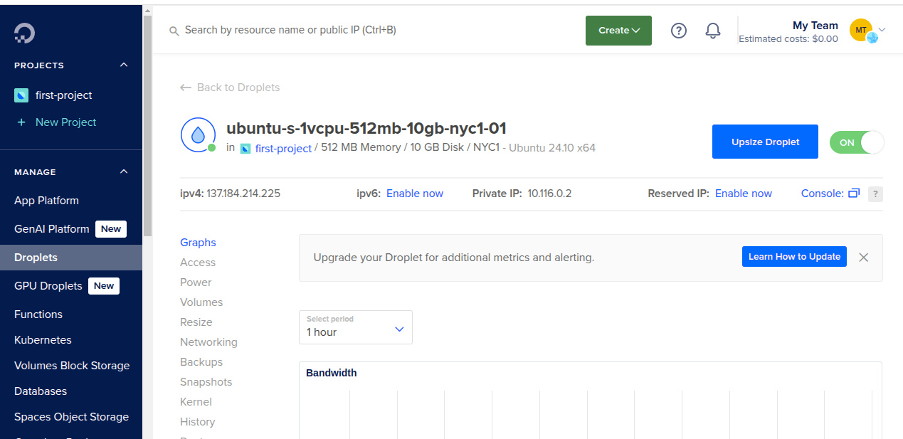

# Demo Project

Create server and deploy application on DigitalOcean

## Technologies Used

- Digital Ocean, Linux, Java, Gradle

## Project Description

- Set up and configure a server on DigitalOcean, connecting to it via SSH using a key pair generated locally.
- Build the application using Java Gradle in IntelliJ IDEA, copy the artifact to the server, and deploy the application on the Droplet.
- Create and configure a new Linux user on the Droplet, using the same key pair as the root user.

### Details of project

- Project Setup: Creating a Server Droplet on DigitalOcean

  In this project, a new droplet was created on DigitalOcean to serve as a server. The steps taken to set it up are outlined below:

    - On the homepage, click Create Droplet

    - Choose the region closest to your location

    - Select the latest Ubuntu image

    - Choose the Basic Plan

    - Select the minimum CPU option to reduce costs

  - SSH Authentication

    For authentication, an SSH key was used, as it's the most secure method. A new SSH key was generated to be used for this and any future servers throughout the project.

    The SSH public key was added manually to the droplet. It was obtained using the following command locally:

    ```
      cat ~/.ssh/id_rsa.pub
    ```

    Once the key was set, the droplet was successfully created.

    

  - Firewall Configuration

    By default, the server allows traffic on all ports, which poses a security risk. To improve this, a firewall was configured in the Networking section, named my-droplet-firewall. This firewall restricts access and only allows port 22 for SSH. Outbound traffic was restricted to only my IP address.

    

    After creating the firewall, it was attached to the droplet.

- Connecting to the Droplet

To connect to the droplet, use the command:

  ```
    ssh root@<DROPLET_IP>
  ```

  - Installing Java on the Droplet

    Java version 8 was installed, as it will be used in the Nexus module:

    ```
      apt update
      apt install openjdk-8-jre-headless
    ```
    Next, a Java application with a UI was downloaded from the repository provided in the lesson. The application was built using Gradle, and the resulting artifact was transferred to the server with the following command:

    ```
      scp build/libs/java-react-example.jar root@137.184.214.225:/root
    ```
    Once the transfer was complete, the application was started using:

    ```
      java -jar java-react-example.jar
    ```

    To access the application from a browser, port 7071 must be opened in the firewall. After that, navigating to the server’s IP address with port 7071 in the browser will load the application.

    

- Creating a Linux User

  As a security measure, a new user was created to avoid using the root account unnecessarily.

  

  Additionally, the user was added to the sudo group with the command:

  ```
    usermod -aG sudo <Username>
  ```

  This allows the user to execute commands with sudo privileges. However, SSH access is not yet possible with the new user because the SSH key permissions are not yet configured.

T  o fix this, while logged into the server, switch to the new user account, then:

  Create a .ssh directory:

  ```
    mkdir ~/.ssh
  ```

  Create a file named authorized_keys inside it:

  ```
    vim ~/.ssh/authorized_keys
  ```

  Paste your SSH public key into this file.

  Once this is done, SSH access with the new user is fully configured.
  
  
